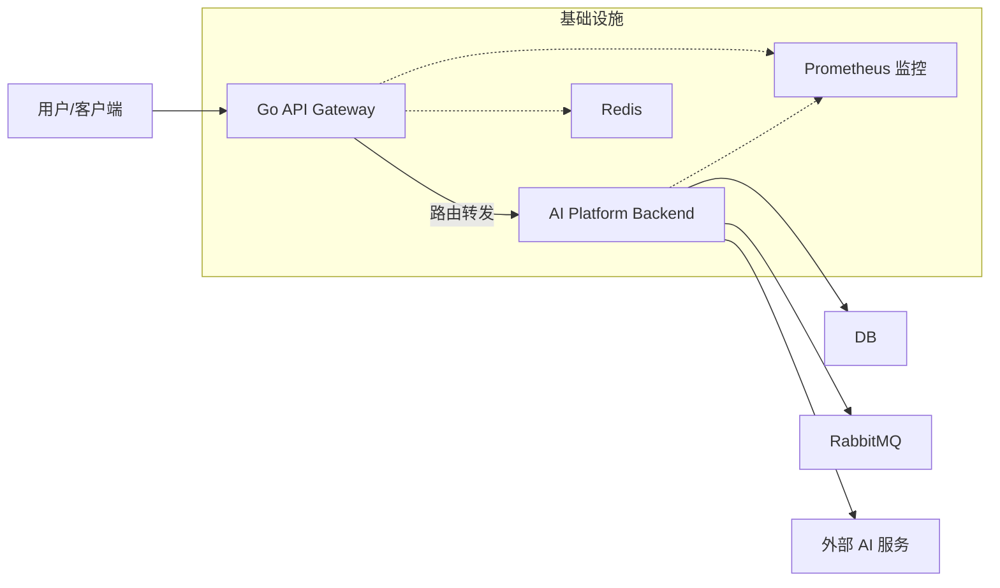

基于您提供的两个项目（`go-api-gateway` 和 `ai-platform-backend`）的详细信息，我为您撰写了一份充实且结构完整的顶层 `README.md` 文件。这份文档旨在作为整个解决方案的入口，清晰地展示系统架构、各子项目功能以及协作关系。

您可以直接将以下内容保存为根目录下的 `README.md`。

------

# AI Platform Solution

本项目是一个完整的 AI 服务平台解决方案，由 **API 网关层** (`go-api-gateway`) 和 **后端服务层** (`ai-platform-backend`) 组成。系统设计采用微服务架构思想，旨在提供高可用、可扩展的 AI 模型调用、订单管理、配额控制及流量治理能力。

## 🏗️ 系统架构

系统分为两个核心子项目，协同工作以处理用户请求：

1. **Go API Gateway**: 作为系统的统一入口，负责流量接入、负载均衡、身份认证、速率限制及路由转发。
2. **AI Platform Backend**: 基于 Spring Boot 的核心业务服务，处理具体的 AI 调用逻辑、订单支付、配额管理及数据统计。



------

## 📂 项目结构

本仓库包含以下两个主要子目录：

### 1. `go-api-gateway`

高性能 Go 语言编写的 API 网关。

- **核心职责**: 请求路由、负载均衡 (轮询/加权/最少连接)、认证 (API Key/JWT)、限流 (本地/Redis)。
- **技术栈**: Go 1.18+, YAML 配置, Prometheus。
- **详见**: [go-api-gateway/README.md](https://www.qianwen.com/chat/go-api-gateway/README.md)

### 2. `ai-platform-backend`

基于 Spring Boot 的 AI 业务后端。

- **核心职责**: AI 模型调用代理、订单生命周期管理、配额扣减与发放、使用统计、审计日志。
- **技术栈**: Spring Boot 3.4, MyBatis-Plus, MySQL, RabbitMQ, Java 17。
- **详见**: [ai-platform-backend/README.md](https://www.qianwen.com/chat/ai-platform-backend/README.md)

------

## 🚀 快速开始

要运行整个平台，您需要分别启动网关服务和后端服务。

### 前置环境要求

确保您的开发环境已安装以下软件：

- **Java**: JDK 17+
- **Go**: 1.18+
- **数据库**: MySQL 5.7+
- **消息队列**: RabbitMQ 3.8+
- **缓存 (可选)**: Redis (用于网关分布式限流)
- **构建工具**: Maven 3.6+, Go Modules

### 第一步：初始化数据库

进入 `ai-platform-backend` 目录，执行 SQL 脚本：

```bash
cd ai-platform-backend
# 在 MySQL 中执行
mysql -u root -p < sql/create.sql
```

### 第二步：配置后端服务

编辑 `ai-platform-backend/src/main/resources/application.yml`，配置数据库和 RabbitMQ 连接信息：

```yaml
spring:
  datasource:
    url: jdbc:mysql://localhost:3306/ai_platform?useSSL=false&serverTimezone=UTC&characterEncoding=utf-8
    username: root
    password: your_password
  rabbitmq:
    host: localhost
    port: 5672
    username: guest
    password: guest
```

### 第三步：配置网关服务

编辑 `go-api-gateway/config/config.yml`，配置上游服务指向后端接口，并设置认证策略：

```yaml
server:
  port: 8080

auth:
  strategy: "apikey"
  api_keys:
    - "my-secret-key-123"

upstreams:
  - path_prefix: "/api"
    backends:
      - url: "http://localhost:8081" # 假设后端服务运行在 8081 端口
    rate_limit:
      strategy: "local"
      rps: 50
```

### 第四步：启动服务

**终端 1：启动后端服务**

```bash
cd ai-platform-backend
mvn clean package
java -jar target/ai-platform-backend-0.0.1-SNAPSHOT.jar
# 默认端口: 8081 (请根据实际 application.yml 配置确认)
```

**终端 2：启动网关服务**

```bash
cd go-api-gateway
go run cmd/main.go
# 默认端口: 8080
```

------

## 🔌 API 使用示例

所有请求应发送至 **Go API Gateway** (`http://localhost:8080`)，网关将自动转发至后端。

### 1. AI 聊天调用

**请求**:

```bash
curl -X POST http://localhost:8080/api/v1/chat/completions \
  -H "Content-Type: application/json" \
  -H "X-API-Key: my-secret-key-123" \
  -d '{"prompt": "你好，世界！"}'
```

**响应**:

```json
{
  "code": 200,
  "message": "success",
  "data": "Mock AI Response: {prompt=你好，世界！}"
}
```

### 2. 创建订单

**请求**:

```bash
curl -X POST http://localhost:8080/api/v1/order/create \
  -H "Content-Type: application/json" \
  -H "X-API-Key: my-secret-key-123" \
  -d '{"amount": 100, "priceCents": 990}'
```

### 3. 查看使用统计

**请求**:

```bash
curl -X GET "http://localhost:8080/api/v1/stats/usage?period=TODAY" \
  -H "X-API-Key: my-secret-key-123"
```

------

## 🛡️ 核心功能特性

### 网关层 (Go API Gateway)

- **智能负载均衡**: 支持轮询、加权轮询及最少连接算法，灵活分配后端流量。
- **多重认证**: 内置 API Key 和 JWT 认证中间件，保障接口安全。
- **精细化限流**: 支持基于 IP、API Key 等维度的本地或 Redis 分布式限流。
- **可观测性**: 集成 Prometheus 指标暴露，支持健康检查端点。

### 后端层 (AI Platform Backend)

- **全链路配额管理**: 实现配额预扣减、支付后异步发放及不足回滚机制。
- **异步审计**: 通过 RabbitMQ 解耦，异步记录详细的 API 调用审计日志。
- **订单状态机**: 完善的订单创建、支付回调处理及状态流转逻辑。
- **实时监控**: 暴露 Actuator 端点，结合 Prometheus 监控系统健康度。

------

## 📊 监控与运维

系统集成了统一的监控方案：

- **健康检查**:
  - 网关: `http://localhost:8080/health`
  - 后端: `http://localhost:8081/actuator/health`
- **指标采集 (Prometheus)**:
  - 网关: `http://localhost:8080/metrics`
  - 后端: `http://localhost:8081/actuator/prometheus`

建议部署 Prometheus + Grafana 栈来可视化这些指标，监控 QPS、延迟、错误率及配额使用情况。

------

## 📝 开发与贡献

- 代码风格: 
  - Go 部分遵循 `gofmt` 及标准 Go 社区规范。
  - Java 部分遵循 Spring Boot 编码规范，使用 Lombok 简化代码。
- 测试: 
  - Go: `go test ./...`
  - Java: `mvn test`

欢迎提交 Issue 和 Pull Request 来改进本项目。

## 📄 许可证

本项目采用 **MIT License**。

## 👥 联系方式

- **作者**: Addery
- **邮箱**: [addery8023@163.com](mailto:addery@example.com)
- **项目地址**: [Addery/ai-project: AI API开放平台](https://github.com/Addery/ai-project)